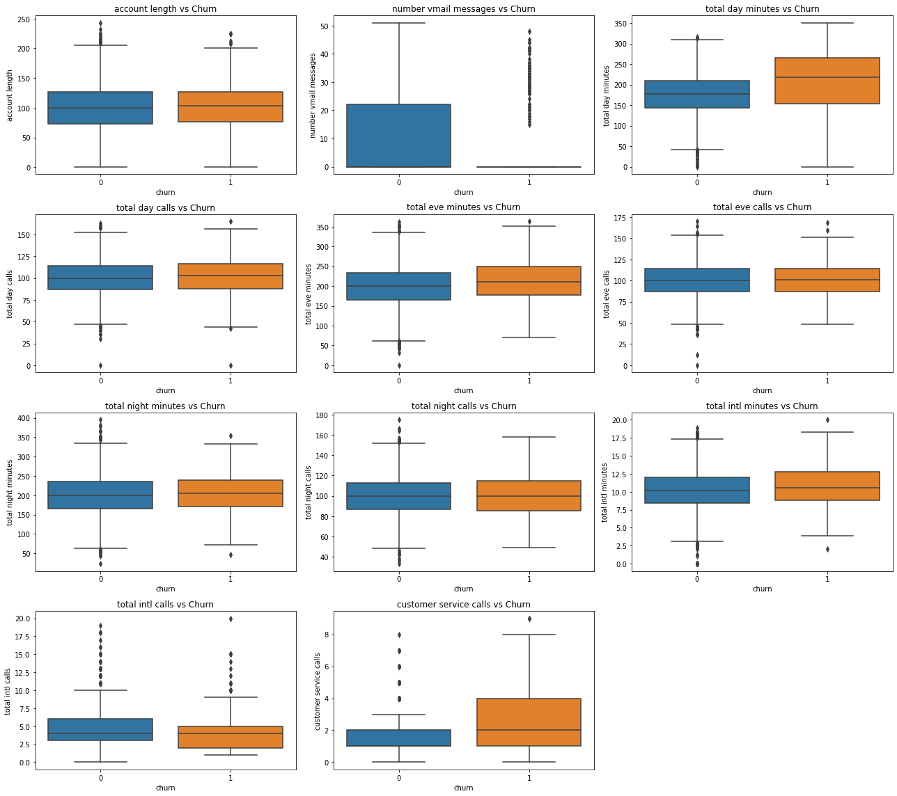

# SyriaTel Customer Churn

## Business Understanding

SyriaTel operates in a competitive telecom market where retaining existing customers is more cost-effective than acquiring new ones. All available customers are sure to have existing service providers. The real difference is market  share which is more easier to lose than to gain. A user may change to another network to get more value for money but the most critical is reliability.  High churn directly impacts profitability, market share, and customer lifetime value (CLV). SyriaTel requires a reliable way to anticipate which customers are most likely to leave, so proactive retention strategies can be applied.

### Problem Statement

Customer churn is a revenue-critical issue for SyriaTel. Without early detection of at-risk customers, the company loses not only recurring revenue but also faces higher acquisition costs. This project develops machine learning models to predict churn using historical customer behavior and service data.

### Objectives

1. To Build and compare two machine learning model, that is Logistic Regression and Random Forest.

2. Identify key factors influencing churn.

3. Provide actionable business recommendations to reduce churn.

## Methodology and Metrics of success

Exploratory Data Analysis (EDA): Investigated patterns in churn vs. usage behavior.

Feature Engineering & Scaling: Removed redundant features (charges), handled class imbalance (SMOTE), and scaled predictors.

Modeling Approaches:

Logistic Regression: Provided coefficient-based interpretability, showing the direction and magnitude of churn drivers.

Random Forest: Offered robust predictive performance, captured nonlinear interactions, and ranked feature importance.

Evaluation Metrics: Accuracy, precision, recall, F1-score, and ROC-AUC, with stratified train-test split to preserve churn distribution.


```python
# Import
import numpy as np
import seaborn as sns
import matplotlib.pyplot as plt
import warnings
import pandas as pd
warnings.filterwarnings("ignore")

#import sklearn libraries
from sklearn.preprocessing import LabelEncoder, OneHotEncoder, StandardScaler, MinMaxScaler
from sklearn.model_selection import train_test_split
from imblearn.over_sampling import SMOTE
from sklearn.linear_model import LogisticRegression
from sklearn.ensemble import RandomForestClassifier
from xgboost import XGBClassifier
from sklearn.model_selection import GridSearchCV, RandomizedSearchCV
from scipy.stats import randint
from sklearn.metrics import accuracy_score, confusion_matrix, classification_report,roc_auc_score, roc_curve
from sklearn.model_selection import GridSearchCV, train_test_split
from sklearn.preprocessing import StandardScaler


```


```python
#load and read the dataset
data = pd.read_csv("churn.csv")
# check the head
data[:5]
```


<div>
<style scoped>
    .dataframe tbody tr th:only-of-type {
        vertical-align: middle;
    }

    .dataframe tbody tr th {
        vertical-align: top;
    }

    .dataframe thead th {
        text-align: right;
    }
</style>
<table border="1" class="dataframe">
  <thead>
    <tr style="text-align: right;">
      <th></th>
      <th>state</th>
      <th>account length</th>
      <th>area code</th>
      <th>phone number</th>
      <th>international plan</th>
      <th>voice mail plan</th>
      <th>number vmail messages</th>
      <th>total day minutes</th>
      <th>total day calls</th>
      <th>total day charge</th>
      <th>...</th>
      <th>total eve calls</th>
      <th>total eve charge</th>
      <th>total night minutes</th>
      <th>total night calls</th>
      <th>total night charge</th>
      <th>total intl minutes</th>
      <th>total intl calls</th>
      <th>total intl charge</th>
      <th>customer service calls</th>
      <th>churn</th>
    </tr>
  </thead>
  <tbody>
    <tr>
      <th>0</th>
      <td>KS</td>
      <td>128</td>
      <td>415</td>
      <td>382-4657</td>
      <td>no</td>
      <td>yes</td>
      <td>25</td>
      <td>265.1</td>
      <td>110</td>
      <td>45.07</td>
      <td>...</td>
      <td>99</td>
      <td>16.78</td>
      <td>244.7</td>
      <td>91</td>
      <td>11.01</td>
      <td>10.0</td>
      <td>3</td>
      <td>2.70</td>
      <td>1</td>
      <td>False</td>
    </tr>
    <tr>
      <th>1</th>
      <td>OH</td>
      <td>107</td>
      <td>415</td>
      <td>371-7191</td>
      <td>no</td>
      <td>yes</td>
      <td>26</td>
      <td>161.6</td>
      <td>123</td>
      <td>27.47</td>
      <td>...</td>
      <td>103</td>
      <td>16.62</td>
      <td>254.4</td>
      <td>103</td>
      <td>11.45</td>
      <td>13.7</td>
      <td>3</td>
      <td>3.70</td>
      <td>1</td>
      <td>False</td>
    </tr>
    <tr>
      <th>2</th>
      <td>NJ</td>
      <td>137</td>
      <td>415</td>
      <td>358-1921</td>
      <td>no</td>
      <td>no</td>
      <td>0</td>
      <td>243.4</td>
      <td>114</td>
      <td>41.38</td>
      <td>...</td>
      <td>110</td>
      <td>10.30</td>
      <td>162.6</td>
      <td>104</td>
      <td>7.32</td>
      <td>12.2</td>
      <td>5</td>
      <td>3.29</td>
      <td>0</td>
      <td>False</td>
    </tr>
    <tr>
      <th>3</th>
      <td>OH</td>
      <td>84</td>
      <td>408</td>
      <td>375-9999</td>
      <td>yes</td>
      <td>no</td>
      <td>0</td>
      <td>299.4</td>
      <td>71</td>
      <td>50.90</td>
      <td>...</td>
      <td>88</td>
      <td>5.26</td>
      <td>196.9</td>
      <td>89</td>
      <td>8.86</td>
      <td>6.6</td>
      <td>7</td>
      <td>1.78</td>
      <td>2</td>
      <td>False</td>
    </tr>
    <tr>
      <th>4</th>
      <td>OK</td>
      <td>75</td>
      <td>415</td>
      <td>330-6626</td>
      <td>yes</td>
      <td>no</td>
      <td>0</td>
      <td>166.7</td>
      <td>113</td>
      <td>28.34</td>
      <td>...</td>
      <td>122</td>
      <td>12.61</td>
      <td>186.9</td>
      <td>121</td>
      <td>8.41</td>
      <td>10.1</td>
      <td>3</td>
      <td>2.73</td>
      <td>3</td>
      <td>False</td>
    </tr>
  </tbody>
</table>
<p>5 rows × 21 columns</p>
</div>


```python
# check the tail
data.tail()
```


<div>
<style scoped>
    .dataframe tbody tr th:only-of-type {
        vertical-align: middle;
    }

    .dataframe tbody tr th {
        vertical-align: top;
    }

    .dataframe thead th {
        text-align: right;
    }
</style>
<table border="1" class="dataframe">
  <thead>
    <tr style="text-align: right;">
      <th></th>
      <th>state</th>
      <th>account length</th>
      <th>area code</th>
      <th>phone number</th>
      <th>international plan</th>
      <th>voice mail plan</th>
      <th>number vmail messages</th>
      <th>total day minutes</th>
      <th>total day calls</th>
      <th>total day charge</th>
      <th>...</th>
      <th>total eve calls</th>
      <th>total eve charge</th>
      <th>total night minutes</th>
      <th>total night calls</th>
      <th>total night charge</th>
      <th>total intl minutes</th>
      <th>total intl calls</th>
      <th>total intl charge</th>
      <th>customer service calls</th>
      <th>churn</th>
    </tr>
  </thead>
  <tbody>
    <tr>
      <th>3328</th>
      <td>AZ</td>
      <td>192</td>
      <td>415</td>
      <td>414-4276</td>
      <td>no</td>
      <td>yes</td>
      <td>36</td>
      <td>156.2</td>
      <td>77</td>
      <td>26.55</td>
      <td>...</td>
      <td>126</td>
      <td>18.32</td>
      <td>279.1</td>
      <td>83</td>
      <td>12.56</td>
      <td>9.9</td>
      <td>6</td>
      <td>2.67</td>
      <td>2</td>
      <td>False</td>
    </tr>
    <tr>
      <th>3329</th>
      <td>WV</td>
      <td>68</td>
      <td>415</td>
      <td>370-3271</td>
      <td>no</td>
      <td>no</td>
      <td>0</td>
      <td>231.1</td>
      <td>57</td>
      <td>39.29</td>
      <td>...</td>
      <td>55</td>
      <td>13.04</td>
      <td>191.3</td>
      <td>123</td>
      <td>8.61</td>
      <td>9.6</td>
      <td>4</td>
      <td>2.59</td>
      <td>3</td>
      <td>False</td>
    </tr>
    <tr>
      <th>3330</th>
      <td>RI</td>
      <td>28</td>
      <td>510</td>
      <td>328-8230</td>
      <td>no</td>
      <td>no</td>
      <td>0</td>
      <td>180.8</td>
      <td>109</td>
      <td>30.74</td>
      <td>...</td>
      <td>58</td>
      <td>24.55</td>
      <td>191.9</td>
      <td>91</td>
      <td>8.64</td>
      <td>14.1</td>
      <td>6</td>
      <td>3.81</td>
      <td>2</td>
      <td>False</td>
    </tr>
    <tr>
      <th>3331</th>
      <td>CT</td>
      <td>184</td>
      <td>510</td>
      <td>364-6381</td>
      <td>yes</td>
      <td>no</td>
      <td>0</td>
      <td>213.8</td>
      <td>105</td>
      <td>36.35</td>
      <td>...</td>
      <td>84</td>
      <td>13.57</td>
      <td>139.2</td>
      <td>137</td>
      <td>6.26</td>
      <td>5.0</td>
      <td>10</td>
      <td>1.35</td>
      <td>2</td>
      <td>False</td>
    </tr>
    <tr>
      <th>3332</th>
      <td>TN</td>
      <td>74</td>
      <td>415</td>
      <td>400-4344</td>
      <td>no</td>
      <td>yes</td>
      <td>25</td>
      <td>234.4</td>
      <td>113</td>
      <td>39.85</td>
      <td>...</td>
      <td>82</td>
      <td>22.60</td>
      <td>241.4</td>
      <td>77</td>
      <td>10.86</td>
      <td>13.7</td>
      <td>4</td>
      <td>3.70</td>
      <td>0</td>
      <td>False</td>
    </tr>
  </tbody>
</table>
<p>5 rows × 21 columns</p>
</div>


```python
#shape
print(f" The dataset has {data.shape[0]} records and {data.shape[1]} columns")
```

     The dataset has 3333 records and 21 columns
    


```python
# data types
data.info()
```

    <class 'pandas.core.frame.DataFrame'>
    RangeIndex: 3333 entries, 0 to 3332
    Data columns (total 21 columns):
     #   Column                  Non-Null Count  Dtype  
    ---  ------                  --------------  -----  
     0   state                   3333 non-null   object 
     1   account length          3333 non-null   int64  
     2   area code               3333 non-null   int64  
     3   phone number            3333 non-null   object 
     4   international plan      3333 non-null   object 
     5   voice mail plan         3333 non-null   object 
     6   number vmail messages   3333 non-null   int64  
     7   total day minutes       3333 non-null   float64
     8   total day calls         3333 non-null   int64  
     9   total day charge        3333 non-null   float64
     10  total eve minutes       3333 non-null   float64
     11  total eve calls         3333 non-null   int64  
     12  total eve charge        3333 non-null   float64
     13  total night minutes     3333 non-null   float64
     14  total night calls       3333 non-null   int64  
     15  total night charge      3333 non-null   float64
     16  total intl minutes      3333 non-null   float64
     17  total intl calls        3333 non-null   int64  
     18  total intl charge       3333 non-null   float64
     19  customer service calls  3333 non-null   int64  
     20  churn                   3333 non-null   bool   
    dtypes: bool(1), float64(8), int64(8), object(4)
    memory usage: 524.2+ KB
    


```python

```


```python
#concise stat summary

data.describe()
```


<div>
<style scoped>
    .dataframe tbody tr th:only-of-type {
        vertical-align: middle;
    }

    .dataframe tbody tr th {
        vertical-align: top;
    }

    .dataframe thead th {
        text-align: right;
    }
</style>
<table border="1" class="dataframe">
  <thead>
    <tr style="text-align: right;">
      <th></th>
      <th>account length</th>
      <th>area code</th>
      <th>number vmail messages</th>
      <th>total day minutes</th>
      <th>total day calls</th>
      <th>total day charge</th>
      <th>total eve minutes</th>
      <th>total eve calls</th>
      <th>total eve charge</th>
      <th>total night minutes</th>
      <th>total night calls</th>
      <th>total night charge</th>
      <th>total intl minutes</th>
      <th>total intl calls</th>
      <th>total intl charge</th>
      <th>customer service calls</th>
    </tr>
  </thead>
  <tbody>
    <tr>
      <th>count</th>
      <td>3333.000000</td>
      <td>3333.000000</td>
      <td>3333.000000</td>
      <td>3333.000000</td>
      <td>3333.000000</td>
      <td>3333.000000</td>
      <td>3333.000000</td>
      <td>3333.000000</td>
      <td>3333.000000</td>
      <td>3333.000000</td>
      <td>3333.000000</td>
      <td>3333.000000</td>
      <td>3333.000000</td>
      <td>3333.000000</td>
      <td>3333.000000</td>
      <td>3333.000000</td>
    </tr>
    <tr>
      <th>mean</th>
      <td>101.064806</td>
      <td>437.182418</td>
      <td>8.099010</td>
      <td>179.775098</td>
      <td>100.435644</td>
      <td>30.562307</td>
      <td>200.980348</td>
      <td>100.114311</td>
      <td>17.083540</td>
      <td>200.872037</td>
      <td>100.107711</td>
      <td>9.039325</td>
      <td>10.237294</td>
      <td>4.479448</td>
      <td>2.764581</td>
      <td>1.562856</td>
    </tr>
    <tr>
      <th>std</th>
      <td>39.822106</td>
      <td>42.371290</td>
      <td>13.688365</td>
      <td>54.467389</td>
      <td>20.069084</td>
      <td>9.259435</td>
      <td>50.713844</td>
      <td>19.922625</td>
      <td>4.310668</td>
      <td>50.573847</td>
      <td>19.568609</td>
      <td>2.275873</td>
      <td>2.791840</td>
      <td>2.461214</td>
      <td>0.753773</td>
      <td>1.315491</td>
    </tr>
    <tr>
      <th>min</th>
      <td>1.000000</td>
      <td>408.000000</td>
      <td>0.000000</td>
      <td>0.000000</td>
      <td>0.000000</td>
      <td>0.000000</td>
      <td>0.000000</td>
      <td>0.000000</td>
      <td>0.000000</td>
      <td>23.200000</td>
      <td>33.000000</td>
      <td>1.040000</td>
      <td>0.000000</td>
      <td>0.000000</td>
      <td>0.000000</td>
      <td>0.000000</td>
    </tr>
    <tr>
      <th>25%</th>
      <td>74.000000</td>
      <td>408.000000</td>
      <td>0.000000</td>
      <td>143.700000</td>
      <td>87.000000</td>
      <td>24.430000</td>
      <td>166.600000</td>
      <td>87.000000</td>
      <td>14.160000</td>
      <td>167.000000</td>
      <td>87.000000</td>
      <td>7.520000</td>
      <td>8.500000</td>
      <td>3.000000</td>
      <td>2.300000</td>
      <td>1.000000</td>
    </tr>
    <tr>
      <th>50%</th>
      <td>101.000000</td>
      <td>415.000000</td>
      <td>0.000000</td>
      <td>179.400000</td>
      <td>101.000000</td>
      <td>30.500000</td>
      <td>201.400000</td>
      <td>100.000000</td>
      <td>17.120000</td>
      <td>201.200000</td>
      <td>100.000000</td>
      <td>9.050000</td>
      <td>10.300000</td>
      <td>4.000000</td>
      <td>2.780000</td>
      <td>1.000000</td>
    </tr>
    <tr>
      <th>75%</th>
      <td>127.000000</td>
      <td>510.000000</td>
      <td>20.000000</td>
      <td>216.400000</td>
      <td>114.000000</td>
      <td>36.790000</td>
      <td>235.300000</td>
      <td>114.000000</td>
      <td>20.000000</td>
      <td>235.300000</td>
      <td>113.000000</td>
      <td>10.590000</td>
      <td>12.100000</td>
      <td>6.000000</td>
      <td>3.270000</td>
      <td>2.000000</td>
    </tr>
    <tr>
      <th>max</th>
      <td>243.000000</td>
      <td>510.000000</td>
      <td>51.000000</td>
      <td>350.800000</td>
      <td>165.000000</td>
      <td>59.640000</td>
      <td>363.700000</td>
      <td>170.000000</td>
      <td>30.910000</td>
      <td>395.000000</td>
      <td>175.000000</td>
      <td>17.770000</td>
      <td>20.000000</td>
      <td>20.000000</td>
      <td>5.400000</td>
      <td>9.000000</td>
    </tr>
  </tbody>
</table>
</div>


```python
#check unique values

for coln in data:
    uni_vale =data[coln].unique()
    print(f" {coln}\n, {uni_vale}\n")
```

     state
    , ['KS' 'OH' 'NJ' 'OK' 'AL' 'MA' 'MO' 'LA' 'WV' 'IN' 'RI' 'IA' 'MT' 'NY'
     'ID' 'VT' 'VA' 'TX' 'FL' 'CO' 'AZ' 'SC' 'NE' 'WY' 'HI' 'IL' 'NH' 'GA'
     'AK' 'MD' 'AR' 'WI' 'OR' 'MI' 'DE' 'UT' 'CA' 'MN' 'SD' 'NC' 'WA' 'NM'
     'NV' 'DC' 'KY' 'ME' 'MS' 'TN' 'PA' 'CT' 'ND']
    
     account length
    , [128 107 137  84  75 118 121 147 117 141  65  74 168  95  62 161  85  93
      76  73  77 130 111 132 174  57  54  20  49 142 172  12  72  36  78 136
     149  98 135  34 160  64  59 119  97  52  60  10  96  87  81  68 125 116
      38  40  43 113 126 150 138 162  90  50  82 144  46  70  55 106  94 155
      80 104  99 120 108 122 157 103  63 112  41 193  61  92 131 163  91 127
     110 140  83 145  56 151 139   6 115 146 185 148  32  25 179  67  19 170
     164  51 208  53 105  66  86  35  88 123  45 100 215  22  33 114  24 101
     143  48  71 167  89 199 166 158 196 209  16  39 173 129  44  79  31 124
      37 159 194 154  21 133 224  58  11 109 102 165  18  30 176  47 190 152
      26  69 186 171  28 153 169  13  27   3  42 189 156 134 243  23   1 205
     200   5   9 178 181 182 217 177 210  29 180   2  17   7 212 232 192 195
     197 225 184 191 201  15 183 202   8 175   4 188 204 221]
    
     area code
    , [415 408 510]
    
     phone number
    , ['382-4657' '371-7191' '358-1921' ... '328-8230' '364-6381' '400-4344']
    
     international plan
    , ['no' 'yes']
    
     voice mail plan
    , ['yes' 'no']
    
     number vmail messages
    , [25 26  0 24 37 27 33 39 30 41 28 34 46 29 35 21 32 42 36 22 23 43 31 38
     40 48 18 17 45 16 20 14 19 51 15 11 12 47  8 44 49  4 10 13 50  9]
    
     total day minutes
    , [265.1 161.6 243.4 ... 321.1 231.1 180.8]
    
     total day calls
    , [110 123 114  71 113  98  88  79  97  84 137 127  96  70  67 139  66  90
     117  89 112 103  86  76 115  73 109  95 105 121 118  94  80 128  64 106
     102  85  82  77 120 133 135 108  57  83 129  91  92  74  93 101 146  72
      99 104 125  61 100  87 131  65 124 119  52  68 107  47 116 151 126 122
     111 145  78 136 140 148  81  55  69 158 134 130  63  53  75 141 163  59
     132 138  54  58  62 144 143 147  36  40 150  56  51 165  30  48  60  42
       0  45 160 149 152 142 156  35  49 157  44]
    
     total day charge
    , [45.07 27.47 41.38 ... 54.59 39.29 30.74]
    
     total eve minutes
    , [197.4 195.5 121.2 ... 153.4 288.8 265.9]
    
     total eve calls
    , [ 99 103 110  88 122 101 108  94  80 111  83 148  71  75  76  97  90  65
      93 121 102  72 112 100  84 109  63 107 115 119 116  92  85  98 118  74
     117  58  96  66  67  62  77 164 126 142  64 104  79  95  86 105  81 113
     106  59  48  82  87 123 114 140 128  60  78 125  91  46 138 129  89 133
     136  57 135 139  51  70 151 137 134  73 152 168  68 120  69 127 132 143
      61 124  42  54 131  52 149  56  37 130  49 146 147  55  12  50 157 155
      45 144  36 156  53 141  44 153 154 150  43   0 145 159 170]
    
     total eve charge
    , [16.78 16.62 10.3  ... 13.04 24.55 22.6 ]
    
     total night minutes
    , [244.7 254.4 162.6 ... 280.9 120.1 279.1]
    
     total night calls
    , [ 91 103 104  89 121 118  96  90  97 111  94 128 115  99  75 108  74 133
      64  78 105  68 102 148  98 116  71 109 107 135  92  86 127  79  87 129
      57  77  95  54 106  53  67 139  60 100  61  73 113  76 119  88  84  62
     137  72 142 114 126 122  81 123 117  82  80 120 130 134  59 112 132 110
     101 150  69 131  83  93 124 136 125  66 143  58  55  85  56  70  46  42
     152  44 145  50 153  49 175  63 138 154 140 141 146  65  51 151 158 155
     157 147 144 149 166  52  33 156  38  36  48 164]
    
     total night charge
    , [11.01 11.45  7.32  8.86  8.41  9.18  9.57  9.53  9.71 14.69  9.4   8.82
      6.35  8.65  9.14  7.23  4.02  5.83  7.46  8.68  9.43  8.18  8.53 10.67
     11.28  8.22  4.59  8.17  8.04 11.27 11.08 13.2  12.61  9.61  6.88  5.82
     10.25  4.58  8.47  8.45  5.5  14.02  8.03 11.94  7.34  6.06 10.9   6.44
      3.18 10.66 11.21 12.73 10.28 12.16  6.34  8.15  5.84  8.52  7.5   7.48
      6.21 11.95  7.15  9.63  7.1   6.91  6.69 13.29 11.46  7.76  6.86  8.16
     12.15  7.79  7.99 10.29 10.08 12.53  7.91 10.02  8.61 14.54  8.21  9.09
      4.93 11.39 11.88  5.75  7.83  8.59  7.52 12.38  7.21  5.81  8.1  11.04
     11.19  8.55  8.42  9.76  9.87 10.86  5.36 10.03 11.15  9.51  6.22  2.59
      7.65  6.45  9.    6.4   9.94  5.08 10.23 11.36  6.97 10.16  7.88 11.91
      6.61 11.55 11.76  9.27  9.29 11.12 10.69  8.8  11.85  7.14  8.71 11.42
      4.94  9.02 11.22  4.97  9.15  5.45  7.27 12.91  7.75 13.46  6.32 12.13
     11.97  6.93 11.66  7.42  6.19 11.41 10.33 10.65 11.92  4.77  4.38  7.41
     12.1   7.69  8.78  9.36  9.05 12.7   6.16  6.05 10.85  8.93  3.48 10.4
      5.05 10.71  9.37  6.75  8.12 11.77 11.49 11.06 11.25 11.03 10.82  8.91
      8.57  8.09 10.05 11.7  10.17  8.74  5.51 11.11  3.29 10.13  6.8   8.49
      9.55 11.02  9.91  7.84 10.62  9.97  3.44  7.35  9.79  8.89  8.14  6.94
     10.49 10.57 10.2   6.29  8.79 10.04 12.41 15.97  9.1  11.78 12.75 11.07
     12.56  8.63  8.02 10.42  8.7   9.98  7.62  8.33  6.59 13.12 10.46  6.63
      8.32  9.04  9.28 10.76  9.64 11.44  6.48 10.81 12.66 11.34  8.75 13.05
     11.48 14.04 13.47  5.63  6.6   9.72 11.68  6.41  9.32 12.95 13.37  9.62
      6.03  8.25  8.26 11.96  9.9   9.23  5.58  7.22  6.64 12.29 12.93 11.32
      6.85  8.88  7.03  8.48  3.59  5.86  6.23  7.61  7.66 13.63  7.9  11.82
      7.47  6.08  8.4   5.74 10.94 10.35 10.68  4.34  8.73  5.14  8.24  9.99
     13.93  8.64 11.43  5.79  9.2  10.14 12.11  7.53 12.46  8.46  8.95  9.84
     10.8  11.23 10.15  9.21 14.46  6.67 12.83  9.66  9.59 10.48  8.36  4.84
     10.54  8.39  7.43  9.06  8.94 11.13  8.87  8.5   7.6  10.73  9.56 10.77
      7.73  3.47 11.86  8.11  9.78  9.42  9.65  7.    7.39  9.88  6.56  5.92
      6.95 15.71  8.06  4.86  7.8   8.58 10.06  5.21  6.92  6.15 13.49  9.38
     12.62 12.26  8.19 11.65 11.62 10.83  7.92  7.33 13.01 13.26 12.22 11.58
      5.97 10.99  8.38  9.17  8.08  5.71  3.41 12.63 11.79 12.96  7.64  6.58
     10.84 10.22  6.52  5.55  7.63  5.11  5.89 10.78  3.05 11.89  8.97 10.44
     10.5   9.35  5.66 11.09  9.83  5.44 10.11  6.39 11.93  8.62 12.06  6.02
      8.85  5.25  8.66  6.73 10.21 11.59 13.87  7.77 10.39  5.54  6.62 13.33
      6.24 12.59  6.3   6.79  8.28  9.03  8.07  5.52 12.14 10.59  7.54  7.67
      5.47  8.81  8.51 13.45  8.77  6.43 12.01 12.08  7.07  6.51  6.84  9.48
     13.78 11.54 11.67  8.13 10.79  7.13  4.72  4.64  8.96 13.03  6.07  3.51
      6.83  6.12  9.31  9.58  4.68  5.32  9.26 11.52  9.11 10.55 11.47  9.3
     13.82  8.44  5.77 10.96 11.74  8.9  10.47  7.85 10.92  4.74  9.74 10.43
      9.96 10.18  9.54  7.89 12.36  8.54 10.07  9.46  7.3  11.16  9.16 10.19
      5.99 10.88  5.8   7.19  4.55  8.31  8.01 14.43  8.3  14.3   6.53  8.2
     11.31 13.    6.42  4.24  7.44  7.51 13.1   9.49  6.14  8.76  6.65 10.56
      6.72  8.29 12.09  5.39  2.96  7.59  7.24  4.28  9.7   8.83 13.3  11.37
      9.33  5.01  3.26 11.71  8.43  9.68 15.56  9.8   3.61  6.96 11.61 12.81
     10.87 13.84  5.03  5.17  2.03 10.34  9.34  7.95 10.09  9.95  7.11  9.22
      6.13 11.05  9.89  9.39 14.06 10.26 13.31 15.43 16.39  6.27 10.64 11.5
     12.48  8.27 13.53 10.36 12.24  8.69 10.52  9.07 11.51  9.25  8.72  6.78
      8.6  11.84  5.78  5.85 12.3   5.76 12.07  9.6   8.84 12.39 10.1   9.73
      2.85  6.66  2.45  5.28 11.73 10.75  7.74  6.76  6.    7.58 13.69  7.93
      7.68  9.75  4.96  5.49 11.83  7.18  9.19  7.7   7.25 10.74  4.27 13.8
      9.12  4.75  7.78 11.63  7.55  2.25  9.45  9.86  7.71  4.95  7.4  11.17
     11.33  6.82 13.7   1.97 10.89 12.77 10.31  5.23  5.27  9.41  6.09 10.61
      7.29  4.23  7.57  3.67 12.69 14.5   5.95  7.87  5.96  5.94 12.23  4.9
     12.33  6.89  9.67 12.68 12.87  3.7   6.04 13.13 15.74 11.87  4.7   4.67
      7.05  5.42  4.09  5.73  9.47  8.05  6.87  3.71 15.86  7.49 11.69  6.46
     10.45 12.9   5.41 11.26  1.04  6.49  6.37 12.21  6.77 12.65  7.86  9.44
      4.3   7.38  5.02 10.63  2.86 17.19  8.67  8.37  6.9  10.93 10.38  7.36
     10.27 10.95  6.11  4.45 11.9  15.01 12.84  7.45  6.98 11.72  7.56 11.38
     10.    4.42  9.81  5.56  6.01 10.12 12.4  16.99  5.68 11.64  3.78  7.82
      9.85 13.74 12.71 10.98 10.01  9.52  7.31  8.35 11.35  9.5  14.03  3.2
      7.72 13.22 10.7   8.99 10.6  13.02  9.77 12.58 12.35 12.2  11.4  13.91
      3.57 14.65 12.28  5.13 10.72 12.86 14.    7.12 12.17  4.71  6.28  8.
      7.01  5.91  5.2  12.   12.02 12.88  7.28  5.4  12.04  5.24 10.3  10.41
     13.41 12.72  9.08  7.08 13.5   5.35 12.45  5.3  10.32  5.15 12.67  5.22
      5.57  3.94  4.41 13.27 10.24  4.25 12.89  5.72 12.5  11.29  3.25 11.53
      9.82  7.26  4.1  10.37  4.98  6.74 12.52 14.56  8.34  3.82  3.86 13.97
     11.57  6.5  13.58 14.32 13.75 11.14 14.18  9.13  4.46  4.83  9.69 14.13
      7.16  7.98 13.66 14.78 11.2   9.93 11.    5.29  9.92  4.29 11.1  10.51
     12.49  4.04 12.94  7.09  6.71  7.94  5.31  5.98  7.2  14.82 13.21 12.32
     10.58  4.92  6.2   4.47 11.98  6.18  7.81  4.54  5.37  7.17  5.33 14.1
      5.7  12.18  8.98  5.1  14.67 13.95 16.55 11.18  4.44  4.73  2.55  6.31
      2.43  9.24  7.37 13.42 12.42 11.8  14.45  2.89 13.23 12.6  13.18 12.19
     14.81  6.55 11.3  12.27 13.98  8.23 15.49  6.47 13.48 13.59 13.25 17.77
     13.9   3.97 11.56 14.08 13.6   6.26  4.61 12.76 15.76  6.38  3.6  12.8
      5.9   7.97  5.   10.97  5.88 12.34 12.03 14.97 15.06 12.85  6.54 11.24
     12.64  7.06  5.38 13.14  3.99  3.32  4.51  4.12  3.93  2.4  11.75  4.03
     15.85  6.81 14.25 14.09 16.42  6.7  12.74  2.76 12.12  6.99  6.68 11.81
      7.96  5.06 13.16  2.13 13.17  5.12  5.65 12.37 10.53]
    
     total intl minutes
    , [10.  13.7 12.2  6.6 10.1  6.3  7.5  7.1  8.7 11.2 12.7  9.1 12.3 13.1
      5.4 13.8  8.1 13.  10.6  5.7  9.5  7.7 10.3 15.5 14.7 11.1 14.2 12.6
     11.8  8.3 14.5 10.5  9.4 14.6  9.2  3.5  8.5 13.2  7.4  8.8 11.   7.8
      6.8 11.4  9.3  9.7 10.2  8.   5.8 12.1 12.  11.6  8.2  6.2  7.3  6.1
     11.7 15.   9.8 12.4  8.6 10.9 13.9  8.9  7.9  5.3  4.4 12.5 11.3  9.
      9.6 13.3 20.   7.2  6.4 14.1 14.3  6.9 11.5 15.8 12.8 16.2  0.  11.9
      9.9  8.4 10.8 13.4 10.7 17.6  4.7  2.7 13.5 12.9 14.4 10.4  6.7 15.4
      4.5  6.5 15.6  5.9 18.9  7.6  5.   7.  14.  18.  16.  14.8  3.7  2.
      4.8 15.3  6.  13.6 17.2 17.5  5.6 18.2  3.6 16.5  4.6  5.1  4.1 16.3
     14.9 16.4 16.7  1.3 15.2 15.1 15.9  5.5 16.1  4.  16.9  5.2  4.2 15.7
     17.   3.9  3.8  2.2 17.1  4.9 17.9 17.3 18.4 17.8  4.3  2.9  3.1  3.3
      2.6  3.4  1.1 18.3 16.6  2.1  2.4  2.5]
    
     total intl calls
    , [ 3  5  7  6  4  2  9 19  1 10 15  8 11  0 12 13 18 14 16 20 17]
    
     total intl charge
    , [2.7  3.7  3.29 1.78 2.73 1.7  2.03 1.92 2.35 3.02 3.43 2.46 3.32 3.54
     1.46 3.73 2.19 3.51 2.86 1.54 2.57 2.08 2.78 4.19 3.97 3.   3.83 3.4
     3.19 2.24 3.92 2.84 2.54 3.94 2.48 0.95 2.3  3.56 2.   2.38 2.97 2.11
     1.84 3.08 2.51 2.62 2.75 2.16 1.57 3.27 3.24 3.13 2.21 1.67 1.97 1.65
     3.16 4.05 2.65 3.35 2.32 2.94 3.75 2.4  2.13 1.43 1.19 3.38 3.05 2.43
     2.59 3.59 5.4  1.94 1.73 3.81 3.86 1.86 3.11 4.27 3.46 4.37 0.   3.21
     2.67 2.27 2.92 3.62 2.89 4.75 1.27 0.73 3.65 3.48 3.89 2.81 1.81 4.16
     1.22 1.76 4.21 1.59 5.1  2.05 1.35 1.89 3.78 4.86 4.32 4.   1.   0.54
     1.3  4.13 1.62 3.67 4.64 4.73 1.51 4.91 0.97 4.46 1.24 1.38 1.11 4.4
     4.02 4.43 4.51 0.35 4.1  4.08 4.29 1.49 4.35 1.08 4.56 1.4  1.13 4.24
     4.59 1.05 1.03 0.59 4.62 1.32 4.83 4.67 4.97 4.81 1.16 0.78 0.84 0.89
     0.7  0.92 0.3  4.94 4.48 0.57 0.65 0.68]
    
     customer service calls
    , [1 0 2 3 4 5 7 9 6 8]
    
     churn
    , [False  True]
    
    


```python

(data['churn'].value_counts())
```


    False    2850
    True      483
    Name: churn, dtype: int64


The data set is appropriate for analysis to obtain actionable information about the companies chun rates. However, there is a limitation, namely, class imbalance. The frequency difference between the count of False and True values in the varaiable churn. 

## Data Preparation
### Data Cleaning


```python
# Copy
df1=data.copy(deep=True)
```


```python
# check null values
df1.isna().sum()
```


    state                     0
    account length            0
    area code                 0
    phone number              0
    international plan        0
    voice mail plan           0
    number vmail messages     0
    total day minutes         0
    total day calls           0
    total day charge          0
    total eve minutes         0
    total eve calls           0
    total eve charge          0
    total night minutes       0
    total night calls         0
    total night charge        0
    total intl minutes        0
    total intl calls          0
    total intl charge         0
    customer service calls    0
    churn                     0
    dtype: int64


This make the work easier as there are no missing values in anay of the columns


```python
#check duplicates
df1.duplicated().sum()
```


    0


```python
# columns to drop
colns=df1[["phone number","area code","state"]]
# drop columns
df1=df1.drop(colns,axis=1)
```


```python
df1.columns.tolist()
```


    ['account length',
     'international plan',
     'voice mail plan',
     'number vmail messages',
     'total day minutes',
     'total day calls',
     'total day charge',
     'total eve minutes',
     'total eve calls',
     'total eve charge',
     'total night minutes',
     'total night calls',
     'total night charge',
     'total intl minutes',
     'total intl calls',
     'total intl charge',
     'customer service calls',
     'churn']


## Data Exploration Analysis


```python
#preocess the categorical columns
cat = df1.select_dtypes("object")
cat_dumm = pd.get_dummies(cat, drop_first=True, dtype="int")
cat_dumm
```


<div>
<style scoped>
    .dataframe tbody tr th:only-of-type {
        vertical-align: middle;
    }

    .dataframe tbody tr th {
        vertical-align: top;
    }

    .dataframe thead th {
        text-align: right;
    }
</style>
<table border="1" class="dataframe">
  <thead>
    <tr style="text-align: right;">
      <th></th>
      <th>international plan_yes</th>
      <th>voice mail plan_yes</th>
    </tr>
  </thead>
  <tbody>
    <tr>
      <th>0</th>
      <td>0</td>
      <td>1</td>
    </tr>
    <tr>
      <th>1</th>
      <td>0</td>
      <td>1</td>
    </tr>
    <tr>
      <th>2</th>
      <td>0</td>
      <td>0</td>
    </tr>
    <tr>
      <th>3</th>
      <td>1</td>
      <td>0</td>
    </tr>
    <tr>
      <th>4</th>
      <td>1</td>
      <td>0</td>
    </tr>
    <tr>
      <th>...</th>
      <td>...</td>
      <td>...</td>
    </tr>
    <tr>
      <th>3328</th>
      <td>0</td>
      <td>1</td>
    </tr>
    <tr>
      <th>3329</th>
      <td>0</td>
      <td>0</td>
    </tr>
    <tr>
      <th>3330</th>
      <td>0</td>
      <td>0</td>
    </tr>
    <tr>
      <th>3331</th>
      <td>1</td>
      <td>0</td>
    </tr>
    <tr>
      <th>3332</th>
      <td>0</td>
      <td>1</td>
    </tr>
  </tbody>
</table>
<p>3333 rows × 2 columns</p>
</div>


```python
merged_df = pd.concat([df1, cat_dumm], axis=1)
merged_df
```


<div>
<style scoped>
    .dataframe tbody tr th:only-of-type {
        vertical-align: middle;
    }

    .dataframe tbody tr th {
        vertical-align: top;
    }

    .dataframe thead th {
        text-align: right;
    }
</style>
<table border="1" class="dataframe">
  <thead>
    <tr style="text-align: right;">
      <th></th>
      <th>account length</th>
      <th>international plan</th>
      <th>voice mail plan</th>
      <th>number vmail messages</th>
      <th>total day minutes</th>
      <th>total day calls</th>
      <th>total day charge</th>
      <th>total eve minutes</th>
      <th>total eve calls</th>
      <th>total eve charge</th>
      <th>total night minutes</th>
      <th>total night calls</th>
      <th>total night charge</th>
      <th>total intl minutes</th>
      <th>total intl calls</th>
      <th>total intl charge</th>
      <th>customer service calls</th>
      <th>churn</th>
      <th>international plan_yes</th>
      <th>voice mail plan_yes</th>
    </tr>
  </thead>
  <tbody>
    <tr>
      <th>0</th>
      <td>128</td>
      <td>no</td>
      <td>yes</td>
      <td>25</td>
      <td>265.1</td>
      <td>110</td>
      <td>45.07</td>
      <td>197.4</td>
      <td>99</td>
      <td>16.78</td>
      <td>244.7</td>
      <td>91</td>
      <td>11.01</td>
      <td>10.0</td>
      <td>3</td>
      <td>2.70</td>
      <td>1</td>
      <td>False</td>
      <td>0</td>
      <td>1</td>
    </tr>
    <tr>
      <th>1</th>
      <td>107</td>
      <td>no</td>
      <td>yes</td>
      <td>26</td>
      <td>161.6</td>
      <td>123</td>
      <td>27.47</td>
      <td>195.5</td>
      <td>103</td>
      <td>16.62</td>
      <td>254.4</td>
      <td>103</td>
      <td>11.45</td>
      <td>13.7</td>
      <td>3</td>
      <td>3.70</td>
      <td>1</td>
      <td>False</td>
      <td>0</td>
      <td>1</td>
    </tr>
    <tr>
      <th>2</th>
      <td>137</td>
      <td>no</td>
      <td>no</td>
      <td>0</td>
      <td>243.4</td>
      <td>114</td>
      <td>41.38</td>
      <td>121.2</td>
      <td>110</td>
      <td>10.30</td>
      <td>162.6</td>
      <td>104</td>
      <td>7.32</td>
      <td>12.2</td>
      <td>5</td>
      <td>3.29</td>
      <td>0</td>
      <td>False</td>
      <td>0</td>
      <td>0</td>
    </tr>
    <tr>
      <th>3</th>
      <td>84</td>
      <td>yes</td>
      <td>no</td>
      <td>0</td>
      <td>299.4</td>
      <td>71</td>
      <td>50.90</td>
      <td>61.9</td>
      <td>88</td>
      <td>5.26</td>
      <td>196.9</td>
      <td>89</td>
      <td>8.86</td>
      <td>6.6</td>
      <td>7</td>
      <td>1.78</td>
      <td>2</td>
      <td>False</td>
      <td>1</td>
      <td>0</td>
    </tr>
    <tr>
      <th>4</th>
      <td>75</td>
      <td>yes</td>
      <td>no</td>
      <td>0</td>
      <td>166.7</td>
      <td>113</td>
      <td>28.34</td>
      <td>148.3</td>
      <td>122</td>
      <td>12.61</td>
      <td>186.9</td>
      <td>121</td>
      <td>8.41</td>
      <td>10.1</td>
      <td>3</td>
      <td>2.73</td>
      <td>3</td>
      <td>False</td>
      <td>1</td>
      <td>0</td>
    </tr>
    <tr>
      <th>...</th>
      <td>...</td>
      <td>...</td>
      <td>...</td>
      <td>...</td>
      <td>...</td>
      <td>...</td>
      <td>...</td>
      <td>...</td>
      <td>...</td>
      <td>...</td>
      <td>...</td>
      <td>...</td>
      <td>...</td>
      <td>...</td>
      <td>...</td>
      <td>...</td>
      <td>...</td>
      <td>...</td>
      <td>...</td>
      <td>...</td>
    </tr>
    <tr>
      <th>3328</th>
      <td>192</td>
      <td>no</td>
      <td>yes</td>
      <td>36</td>
      <td>156.2</td>
      <td>77</td>
      <td>26.55</td>
      <td>215.5</td>
      <td>126</td>
      <td>18.32</td>
      <td>279.1</td>
      <td>83</td>
      <td>12.56</td>
      <td>9.9</td>
      <td>6</td>
      <td>2.67</td>
      <td>2</td>
      <td>False</td>
      <td>0</td>
      <td>1</td>
    </tr>
    <tr>
      <th>3329</th>
      <td>68</td>
      <td>no</td>
      <td>no</td>
      <td>0</td>
      <td>231.1</td>
      <td>57</td>
      <td>39.29</td>
      <td>153.4</td>
      <td>55</td>
      <td>13.04</td>
      <td>191.3</td>
      <td>123</td>
      <td>8.61</td>
      <td>9.6</td>
      <td>4</td>
      <td>2.59</td>
      <td>3</td>
      <td>False</td>
      <td>0</td>
      <td>0</td>
    </tr>
    <tr>
      <th>3330</th>
      <td>28</td>
      <td>no</td>
      <td>no</td>
      <td>0</td>
      <td>180.8</td>
      <td>109</td>
      <td>30.74</td>
      <td>288.8</td>
      <td>58</td>
      <td>24.55</td>
      <td>191.9</td>
      <td>91</td>
      <td>8.64</td>
      <td>14.1</td>
      <td>6</td>
      <td>3.81</td>
      <td>2</td>
      <td>False</td>
      <td>0</td>
      <td>0</td>
    </tr>
    <tr>
      <th>3331</th>
      <td>184</td>
      <td>yes</td>
      <td>no</td>
      <td>0</td>
      <td>213.8</td>
      <td>105</td>
      <td>36.35</td>
      <td>159.6</td>
      <td>84</td>
      <td>13.57</td>
      <td>139.2</td>
      <td>137</td>
      <td>6.26</td>
      <td>5.0</td>
      <td>10</td>
      <td>1.35</td>
      <td>2</td>
      <td>False</td>
      <td>1</td>
      <td>0</td>
    </tr>
    <tr>
      <th>3332</th>
      <td>74</td>
      <td>no</td>
      <td>yes</td>
      <td>25</td>
      <td>234.4</td>
      <td>113</td>
      <td>39.85</td>
      <td>265.9</td>
      <td>82</td>
      <td>22.60</td>
      <td>241.4</td>
      <td>77</td>
      <td>10.86</td>
      <td>13.7</td>
      <td>4</td>
      <td>3.70</td>
      <td>0</td>
      <td>False</td>
      <td>0</td>
      <td>1</td>
    </tr>
  </tbody>
</table>
<p>3333 rows × 20 columns</p>
</div>


```python
# Convert churn from bool to int (0/1)
merged_df["churn"] = merged_df["churn"].astype(int)

# Check unique values
merged_df.info()
```

    <class 'pandas.core.frame.DataFrame'>
    RangeIndex: 3333 entries, 0 to 3332
    Data columns (total 20 columns):
     #   Column                  Non-Null Count  Dtype  
    ---  ------                  --------------  -----  
     0   account length          3333 non-null   int64  
     1   international plan      3333 non-null   object 
     2   voice mail plan         3333 non-null   object 
     3   number vmail messages   3333 non-null   int64  
     4   total day minutes       3333 non-null   float64
     5   total day calls         3333 non-null   int64  
     6   total day charge        3333 non-null   float64
     7   total eve minutes       3333 non-null   float64
     8   total eve calls         3333 non-null   int64  
     9   total eve charge        3333 non-null   float64
     10  total night minutes     3333 non-null   float64
     11  total night calls       3333 non-null   int64  
     12  total night charge      3333 non-null   float64
     13  total intl minutes      3333 non-null   float64
     14  total intl calls        3333 non-null   int64  
     15  total intl charge       3333 non-null   float64
     16  customer service calls  3333 non-null   int64  
     17  churn                   3333 non-null   int32  
     18  international plan_yes  3333 non-null   int32  
     19  voice mail plan_yes     3333 non-null   int32  
    dtypes: float64(8), int32(3), int64(7), object(2)
    memory usage: 481.8+ KB
    


```python
#Remove the original columns
merged_df.drop(cat, axis=1, inplace=True)
merged_df.head()
```


<div>
<style scoped>
    .dataframe tbody tr th:only-of-type {
        vertical-align: middle;
    }

    .dataframe tbody tr th {
        vertical-align: top;
    }

    .dataframe thead th {
        text-align: right;
    }
</style>
<table border="1" class="dataframe">
  <thead>
    <tr style="text-align: right;">
      <th></th>
      <th>account length</th>
      <th>number vmail messages</th>
      <th>total day minutes</th>
      <th>total day calls</th>
      <th>total day charge</th>
      <th>total eve minutes</th>
      <th>total eve calls</th>
      <th>total eve charge</th>
      <th>total night minutes</th>
      <th>total night calls</th>
      <th>total night charge</th>
      <th>total intl minutes</th>
      <th>total intl calls</th>
      <th>total intl charge</th>
      <th>customer service calls</th>
      <th>churn</th>
      <th>international plan_yes</th>
      <th>voice mail plan_yes</th>
    </tr>
  </thead>
  <tbody>
    <tr>
      <th>0</th>
      <td>128</td>
      <td>25</td>
      <td>265.1</td>
      <td>110</td>
      <td>45.07</td>
      <td>197.4</td>
      <td>99</td>
      <td>16.78</td>
      <td>244.7</td>
      <td>91</td>
      <td>11.01</td>
      <td>10.0</td>
      <td>3</td>
      <td>2.70</td>
      <td>1</td>
      <td>0</td>
      <td>0</td>
      <td>1</td>
    </tr>
    <tr>
      <th>1</th>
      <td>107</td>
      <td>26</td>
      <td>161.6</td>
      <td>123</td>
      <td>27.47</td>
      <td>195.5</td>
      <td>103</td>
      <td>16.62</td>
      <td>254.4</td>
      <td>103</td>
      <td>11.45</td>
      <td>13.7</td>
      <td>3</td>
      <td>3.70</td>
      <td>1</td>
      <td>0</td>
      <td>0</td>
      <td>1</td>
    </tr>
    <tr>
      <th>2</th>
      <td>137</td>
      <td>0</td>
      <td>243.4</td>
      <td>114</td>
      <td>41.38</td>
      <td>121.2</td>
      <td>110</td>
      <td>10.30</td>
      <td>162.6</td>
      <td>104</td>
      <td>7.32</td>
      <td>12.2</td>
      <td>5</td>
      <td>3.29</td>
      <td>0</td>
      <td>0</td>
      <td>0</td>
      <td>0</td>
    </tr>
    <tr>
      <th>3</th>
      <td>84</td>
      <td>0</td>
      <td>299.4</td>
      <td>71</td>
      <td>50.90</td>
      <td>61.9</td>
      <td>88</td>
      <td>5.26</td>
      <td>196.9</td>
      <td>89</td>
      <td>8.86</td>
      <td>6.6</td>
      <td>7</td>
      <td>1.78</td>
      <td>2</td>
      <td>0</td>
      <td>1</td>
      <td>0</td>
    </tr>
    <tr>
      <th>4</th>
      <td>75</td>
      <td>0</td>
      <td>166.7</td>
      <td>113</td>
      <td>28.34</td>
      <td>148.3</td>
      <td>122</td>
      <td>12.61</td>
      <td>186.9</td>
      <td>121</td>
      <td>8.41</td>
      <td>10.1</td>
      <td>3</td>
      <td>2.73</td>
      <td>3</td>
      <td>0</td>
      <td>1</td>
      <td>0</td>
    </tr>
  </tbody>
</table>
</div>


This is the final merged dataset. Now let's separate the features from the label


```python
#seperate features from label
X = merged_df.drop("churn", axis=1)
y = merged_df["churn"]
```


```python
# Churn distribution
sns.countplot(x=y)
plt.title("Churn Distribution")
plt.show()

# Churn percentage
print(y.value_counts())
```


    

    


    0    2850
    1     483
    Name: churn, dtype: int64
    

### Numerical Features vs. Churn

#### Correlation Between Churn & Numeric Predictors

Since the initial features are many, let's investigate correlation and multicollinearity.


```python
# Compute correlation matrix (numeric only)
corr_matrix = X.corr()

# Display correlation matrix
plt.figure(figsize=(12,8))
sns.heatmap(corr_matrix, annot=False, cmap="coolwarm", center=0)
plt.title("Correlation Heatmap of Features")
plt.show()
```


    

    


The charges columns (day/eve/night/intl) are almost perfectly correlated with their corresponding minutes columns because charge is derived directly from minutes and rate. Therefore, we have to drop the redudant feature, charge. But before that we can compare the features' to the label.


```python

from scipy.stats import pointbiserialr

for col in X:
    corr, pval = pointbiserialr(X[col], y)
    print(f"{col}: correlation={corr:.3f}, p-value={pval:.4f}")
```

    account length: correlation=0.017, p-value=0.3398
    number vmail messages: correlation=-0.090, p-value=0.0000
    total day minutes: correlation=0.205, p-value=0.0000
    total day calls: correlation=0.018, p-value=0.2867
    total day charge: correlation=0.205, p-value=0.0000
    total eve minutes: correlation=0.093, p-value=0.0000
    total eve calls: correlation=0.009, p-value=0.5941
    total eve charge: correlation=0.093, p-value=0.0000
    total night minutes: correlation=0.035, p-value=0.0405
    total night calls: correlation=0.006, p-value=0.7230
    total night charge: correlation=0.035, p-value=0.0405
    total intl minutes: correlation=0.068, p-value=0.0001
    total intl calls: correlation=-0.053, p-value=0.0023
    total intl charge: correlation=0.068, p-value=0.0001
    customer service calls: correlation=0.209, p-value=0.0000
    international plan_yes: correlation=0.260, p-value=0.0000
    voice mail plan_yes: correlation=-0.102, p-value=0.0000
    

We can confirm that charge and minutes having similar correlation on the dependent variable using point-biserial correlation coefficient statistical measure used to determine the relationship between a dichotomous variable.  Let's now drop them. 

Using VIF to select which to drop, it is evident that it has to be charge, since it has higher VIF value in day,evening, night and international.


```python
from statsmodels.stats.outliers_influence import variance_inflation_factor
# Compute VIF
X_vif = X
vif = pd.DataFrame()
vif["feature"] = X_vif.columns
vif["VIF"] = [variance_inflation_factor(X_vif.values, i) for i in range(X_vif.shape[1])]
print(vif)
```

                       feature           VIF
    0           account length  7.197958e+00
    1    number vmail messages  1.607146e+01
    2        total day minutes  1.246201e+08
    3          total day calls  2.178360e+01
    4         total day charge  1.246245e+08
    5        total eve minutes  3.738593e+07
    6          total eve calls  2.198522e+01
    7         total eve charge  3.738689e+07
    8      total night minutes  1.071873e+07
    9        total night calls  2.227654e+01
    10      total night charge  1.071845e+07
    11      total intl minutes  9.980961e+05
    12        total intl calls  4.254404e+00
    13       total intl charge  9.984868e+05
    14  customer service calls  2.377890e+00
    15  international plan_yes  1.116301e+00
    16     voice mail plan_yes  1.645595e+01
    


```python
# Drop redundant 'charge' columns
X = X.drop(columns=[
    "total day charge",
    "total eve charge",
    "total night charge",
    "total intl charge"
])

print("Remaining columns:", X.columns.tolist())
```

    Remaining columns: ['account length', 'number vmail messages', 'total day minutes', 'total day calls', 'total eve minutes', 'total eve calls', 'total night minutes', 'total night calls', 'total intl minutes', 'total intl calls', 'customer service calls', 'international plan_yes', 'voice mail plan_yes']
    


```python


# Set up grid with 3 columns
fig, axes = plt.subplots(len(X)//3, 3, figsize=(18, 4*len(X)//3))
axes = axes.flatten()


for i, col in enumerate(num_cols):
    sns.boxplot(x=y, y=X[col], ax=axes[i])
    axes[i].set_title(f"{col} vs Churn")


plt.tight_layout()
plt.show()

```


    ---------------------------------------------------------------------------

    ValueError                                Traceback (most recent call last)

    <ipython-input-82-c4b55826d4a6> in <module>
          9 
         10 
    ---> 11 plt.tight_layout()
         12 plt.show()
    

    ~\anaconda3\envs\learn-env\lib\site-packages\matplotlib\cbook\deprecation.py in wrapper(*args, **kwargs)
        449                 "parameter will become keyword-only %(removal)s.",
        450                 name=name, obj_type=f"parameter of {func.__name__}()")
    --> 451         return func(*args, **kwargs)
        452 
        453     return wrapper
    

    ~\anaconda3\envs\learn-env\lib\site-packages\matplotlib\pyplot.py in tight_layout(pad, h_pad, w_pad, rect)
       1488         subplots area (including labels) will fit.
       1489     """
    -> 1490     gcf().tight_layout(pad=pad, h_pad=h_pad, w_pad=w_pad, rect=rect)
       1491 
       1492 
    

    ~\anaconda3\envs\learn-env\lib\site-packages\matplotlib\cbook\deprecation.py in wrapper(*inner_args, **inner_kwargs)
        409                          else deprecation_addendum,
        410                 **kwargs)
    --> 411         return func(*inner_args, **inner_kwargs)
        412 
        413     return wrapper
    

    ~\anaconda3\envs\learn-env\lib\site-packages\matplotlib\figure.py in tight_layout(self, renderer, pad, h_pad, w_pad, rect)
       2606 
       2607         if renderer is None:
    -> 2608             renderer = get_renderer(self)
       2609         ctx = (renderer._draw_disabled()
       2610                if hasattr(renderer, '_draw_disabled')
    

    ~\anaconda3\envs\learn-env\lib\site-packages\matplotlib\tight_layout.py in get_renderer(fig)
        171         canvas = fig.canvas
        172         if canvas and hasattr(canvas, "get_renderer"):
    --> 173             return canvas.get_renderer()
        174         else:
        175             from . import backend_bases
    

    ~\anaconda3\envs\learn-env\lib\site-packages\matplotlib\backends\backend_agg.py in get_renderer(self, cleared)
        416                           and getattr(self, "_lastKey", None) == key)
        417         if not reuse_renderer:
    --> 418             self.renderer = RendererAgg(w, h, self.figure.dpi)
        419             self._lastKey = key
        420         elif cleared:
    

    ~\anaconda3\envs\learn-env\lib\site-packages\matplotlib\backends\backend_agg.py in __init__(self, width, height, dpi)
         94         self.width = width
         95         self.height = height
    ---> 96         self._renderer = _RendererAgg(int(width), int(height), dpi)
         97         self._filter_renderers = []
         98 
    

    ValueError: Image size of 1296x319968 pixels is too large. It must be less than 2^16 in each direction.


    ---------------------------------------------------------------------------

    ValueError                                Traceback (most recent call last)

    ~\anaconda3\envs\learn-env\lib\site-packages\IPython\core\formatters.py in __call__(self, obj)
        339                 pass
        340             else:
    --> 341                 return printer(obj)
        342             # Finally look for special method names
        343             method = get_real_method(obj, self.print_method)
    

    ~\anaconda3\envs\learn-env\lib\site-packages\IPython\core\pylabtools.py in <lambda>(fig)
        246 
        247     if 'png' in formats:
    --> 248         png_formatter.for_type(Figure, lambda fig: print_figure(fig, 'png', **kwargs))
        249     if 'retina' in formats or 'png2x' in formats:
        250         png_formatter.for_type(Figure, lambda fig: retina_figure(fig, **kwargs))
    

    ~\anaconda3\envs\learn-env\lib\site-packages\IPython\core\pylabtools.py in print_figure(fig, fmt, bbox_inches, **kwargs)
        130         FigureCanvasBase(fig)
        131 
    --> 132     fig.canvas.print_figure(bytes_io, **kw)
        133     data = bytes_io.getvalue()
        134     if fmt == 'svg':
    

    ~\anaconda3\envs\learn-env\lib\site-packages\matplotlib\backend_bases.py in print_figure(self, filename, dpi, facecolor, edgecolor, orientation, format, bbox_inches, pad_inches, bbox_extra_artists, backend, **kwargs)
       2182             if bbox_inches:
       2183                 if bbox_inches == "tight":
    -> 2184                     renderer = _get_renderer(
       2185                         self.figure,
       2186                         functools.partial(
    

    ~\anaconda3\envs\learn-env\lib\site-packages\matplotlib\backend_bases.py in _get_renderer(figure, print_method)
       1553                 figure.canvas._get_output_canvas(None, fmt), f"print_{fmt}")
       1554         try:
    -> 1555             print_method(io.BytesIO(), dpi=figure.dpi)
       1556         except Done as exc:
       1557             renderer, = figure._cachedRenderer, = exc.args
    

    ~\anaconda3\envs\learn-env\lib\site-packages\matplotlib\backend_bases.py in wrapper(*args, **kwargs)
       1637             kwargs.pop(arg)
       1638 
    -> 1639         return func(*args, **kwargs)
       1640 
       1641     return wrapper
    

    ~\anaconda3\envs\learn-env\lib\site-packages\matplotlib\backends\backend_agg.py in print_png(self, filename_or_obj, metadata, pil_kwargs, *args)
        507             *metadata*, including the default 'Software' key.
        508         """
    --> 509         FigureCanvasAgg.draw(self)
        510         mpl.image.imsave(
        511             filename_or_obj, self.buffer_rgba(), format="png", origin="upper",
    

    ~\anaconda3\envs\learn-env\lib\site-packages\matplotlib\backends\backend_agg.py in draw(self)
        400     def draw(self):
        401         # docstring inherited
    --> 402         self.renderer = self.get_renderer(cleared=True)
        403         # Acquire a lock on the shared font cache.
        404         with RendererAgg.lock, \
    

    ~\anaconda3\envs\learn-env\lib\site-packages\matplotlib\backends\backend_agg.py in get_renderer(self, cleared)
        416                           and getattr(self, "_lastKey", None) == key)
        417         if not reuse_renderer:
    --> 418             self.renderer = RendererAgg(w, h, self.figure.dpi)
        419             self._lastKey = key
        420         elif cleared:
    

    ~\anaconda3\envs\learn-env\lib\site-packages\matplotlib\backends\backend_agg.py in __init__(self, width, height, dpi)
         94         self.width = width
         95         self.height = height
    ---> 96         self._renderer = _RendererAgg(int(width), int(height), dpi)
         97         self._filter_renderers = []
         98 
    

    ValueError: Image size of 1296x319968 pixels is too large. It must be less than 2^16 in each direction.


    <Figure size 1296x319968 with 3333 Axes>


```python
# create grid
num_cols = X.select_dtypes(include=['int64', 'float64']).columns.tolist() # Example to create the list if you don't have it
n_cols = 3
n_rows = (len(num_cols) // n_cols) + (1 if len(num_cols) % n_cols else 0) # This ensures we have enough rows

# Create the subplot grid based on the NUMBER OF FEATURES (len(num_cols)), not the number of samples in X
fig, axes = plt.subplots(n_rows, n_cols, figsize=(18, 4 * n_rows))
axes = axes.flatten() # Flatten the 2D array of axes for easy looping

# Loop through the list of numerical columns
for i, col in enumerate(num_cols):
    sns.boxplot(x=y, y=X[col], ax=axes[i])
    axes[i].set_title(f"{col} vs Churn")

# Hide any unused axes if the total plots don't fill the grid
for j in range(i + 1, len(axes)):
    axes[j].set_visible(False)

plt.tight_layout()
plt.show()
```


    

    


### Categorical Features vs. Churn


```python
cat_cols = ['international plan_yes', 'voice mail plan_yes']

for col in cat_cols:
    plt.figure(figsize=(6,4))
    sns.countplot(x=X[col], hue=y)
    plt.title(f"{col} vs Churn")
    plt.show()

```


    

    


    

    


To interpret these chart, I prefer to look at the proportion of churns of total customers with either international or voicemail plans. For those with international plans, almost half of the customer have churned while only less than a third of those without have churned.
Conversly, those without voice mail plans tend to churn more compared to those without a mail plan.


```python
sns.countplot(x=X["customer service calls"], hue=y)
plt.title("Customer Service Calls vs Churn")
plt.show()

```


    

    


## Modelling


```python
# Train-test split
x_train, x_test, y_train, y_test = train_test_split(
    X, y, test_size=0.2, random_state=42, stratify=y
)

#check shape
x_train.shape, y_train.shape, x_test.shape, y_test.shape
```


    ((2666, 13), (2666,), (667, 13), (667,))


```python

# Scaling
scaler = StandardScaler()
x_train_scaled = scaler.fit_transform(x_train)
x_test_scaled = scaler.transform(x_test)

```

### Logistic regression model


```python
# Baseline Logistic Regression
logreg = LogisticRegression(max_iter=2000, class_weight="balanced", random_state=42)
logmodel=logreg.fit(x_train_scaled, y_train)
y_pred_base = logmodel.predict(x_test_scaled)
y_prob_base = logmodel.predict_proba(x_test_scaled)[:, 1]

print("Baseline Logistic Regression")
print(confusion_matrix(y_test, y_pred_base))
print(classification_report(y_test, y_pred_base))
print("ROC-AUC:", roc_auc_score(y_test, y_prob_base))
```

    Baseline Logistic Regression
    [[434 136]
     [ 25  72]]
                  precision    recall  f1-score   support
    
               0       0.95      0.76      0.84       570
               1       0.35      0.74      0.47        97
    
        accuracy                           0.76       667
       macro avg       0.65      0.75      0.66       667
    weighted avg       0.86      0.76      0.79       667
    
    ROC-AUC: 0.8151021884608429
    

The baseline Logistic Regression model demonstrates a significant trade-off, performing poorly on precision for the minority class (1) at 0.35, meaning most of its predicted positives are incorrect. However, it achieves a much higher recall for the minority class (0.74) compared to the baseline Random Forest, showing it is better at actually finding positive cases. The overall lower ROC-AUC of 0.82 and accuracy of 0.76 confirm that this model is less adept at general discrimination and is heavily influenced by its high false positive rate, as seen in the confusion matrix.


```python
# Hyperparameter grid
param_grid = {
    "C": [0.01, 0.1, 1, 10, 100],     # regularization strength
    "penalty": ["l1", "l2"],          # type of regularization
    "solver": ["liblinear", "saga"]   # solvers that support l1/l2
}

# Grid search
grid = GridSearchCV(
    logreg,
    param_grid,
    cv=5,
    scoring="f1",   # could also try "roc_auc"
    n_jobs=-1
)

# Fit model
grid.fit(x_train, y_train)

# Results
print("Best parameters:", grid.best_params_)
print("Best CV F1 score:", grid.best_score_)

# Evaluate on test set
y_pred = grid.predict(x_test)
print("\nClassification Report:\n", classification_report(y_test, y_pred))
print("Confusion Matrix:\n", confusion_matrix(y_test, y_pred))
print("ROC AUC Score:", roc_auc_score(y_test, grid.predict_proba(x_test)[:, 1]))
```

    Best parameters: {'C': 1, 'penalty': 'l1', 'solver': 'liblinear'}
    Best CV F1 score: 0.48652108582565046
    
    Classification Report:
                   precision    recall  f1-score   support
    
               0       0.94      0.76      0.84       570
               1       0.34      0.73      0.47        97
    
        accuracy                           0.76       667
       macro avg       0.64      0.75      0.66       667
    weighted avg       0.86      0.76      0.79       667
    
    Confusion Matrix:
     [[435 135]
     [ 26  71]]
    ROC AUC Score: 0.8151564478205823
    

This tuned Logistic Regression model, optimized for F1 score, ultimately failed as its best cross-validated F1 of 0.49 is low and the final performance on class 1 remains poor (F1=0.47). The chosen L1 penalty (C=1) suggests feature selection was applied, but the model still suffers from extremely low precision (0.34) for the positive class, meaning it generates a high number of false positives. Consequently, while recall for class 1 is decent (0.71), the model is unreliable for predicting the positive outcome due to its high error rate.

### Random Forest


```python
# Baseline Random Forest

rf = RandomForestClassifier(
    n_estimators=100,
    random_state=42,
    class_weight="balanced"  # handles churn imbalance
)

rf.fit(x_train, y_train)
y_pred_rf = rf.predict(x_test)
y_prob_rf = rf.predict_proba(x_test)[:, 1]

print("\nRandom Forest (Baseline):")
print(classification_report(y_test, y_pred_rf))
print("ROC AUC:", roc_auc_score(y_test, y_prob_rf))
```

    
    Random Forest (Baseline):
                  precision    recall  f1-score   support
    
               0       0.93      0.99      0.96       570
               1       0.90      0.57      0.70        97
    
        accuracy                           0.93       667
       macro avg       0.92      0.78      0.83       667
    weighted avg       0.93      0.93      0.92       667
    
    ROC AUC: 0.8947187556520166
    

The baseline Random Forest model exhibits a critical weakness: while it excels at identifying the majority class (0) with high precision and recall, it performs poorly on the minority class (1), with a recall of only 0.57. This severe class imbalance issue is highlighted by the large gap between the high overall accuracy (0.93) and the low minority-class F1-score (0.70). The strong ROC AUC score of 0.89 is misleading in this context, as it masks the model's failure to reliably detect positive cases, which is often the primary goal in classification tasks like fraud or churn prediction.


```python
# Hyperparameter Tuning
param_grid_rf = {
    "n_estimators": [100, 200, 500],
    "max_depth": [None, 10, 20],
    "min_samples_split": [2, 5, 10],
    "min_samples_leaf": [1, 2, 4]
}

grid_rf = GridSearchCV(
    RandomForestClassifier(random_state=42, class_weight="balanced"),
    param_grid_rf,
    cv=5,
    scoring="f1",
    n_jobs=-1
)

grid_rf.fit(x_train, y_train)
print("\n Best RF Parameters:", grid_rf.best_params_)
print("Best CV F1:", grid_rf.best_score_)
```

    
     Best RF Parameters: {'max_depth': None, 'min_samples_leaf': 1, 'min_samples_split': 10, 'n_estimators': 100}
    Best CV F1: 0.8168452108328029
    

This set of parameters indicates a highly flexible and complex Random Forest model, as the optimal max_depth is None, allowing trees to grow until all leaves are pure. The strong F1 score of 0.82 demonstrates the model successfully achieves an excellent balance between precision and recall on the validation data. This combination of a powerful model architecture and a high F1 score confirms the model is effectively tuned to make accurate and well-rounded predictions.


```python
best_rf = grid_rf.best_estimator_
y_pred_best_rf = best_rf.predict(x_test)
y_prob_best_rf = best_rf.predict_proba(x_test)[:, 1]

print("\n Tuned Random Forest:")
print(classification_report(y_test, y_pred_best_rf))
print("ROC AUC:", roc_auc_score(y_test, y_prob_best_rf))
print("Confusion Matrix:")
print(confusion_matrix(y_test, y_pred_best_rf))
```

    
     Tuned Random Forest:
                  precision    recall  f1-score   support
    
               0       0.95      0.96      0.96       570
               1       0.76      0.72      0.74        97
    
        accuracy                           0.93       667
       macro avg       0.86      0.84      0.85       667
    weighted avg       0.93      0.93      0.93       667
    
    ROC AUC: 0.8970519081208175
    Confusion Matrix:
    [[548  22]
     [ 27  70]]
    


```python
# Plot ROC Curve
fpr, tpr, thresholds = roc_curve(y_test, y_prob_best_rf)
plt.figure(figsize=(6, 6))
plt.plot(fpr, tpr, label=f"Random Forest (AUC = {roc_auc_score(y_test, y_prob_best_rf):.2f})")
plt.plot([0, 1], [0, 1], linestyle="--", color="gray")  # baseline
plt.xlabel("False Positive Rate")
plt.ylabel("True Positive Rate")
plt.title("ROC Curve - Tuned Random Forest")
plt.legend()
plt.show()
```


    

    


Based on the provided information, the tuned Random Forest model demonstrates excellent performance with an AUC score of 0.90. This indicates a very high ability to distinguish between positive and negative classes. The model successfully achieves a high true positive rate while maintaining a relatively low false positive rate. Its performance is considered outstanding for a classification task. This result suggests the model is highly effective and reliable for its intended predictive purpose.


```python
# Feature Importance

importances = pd.Series(best_rf.feature_importances_, index=X.columns)
top_features = importances.sort_values(ascending=False).head(15)
print(top_features)

```

    total day minutes         0.266302
    customer service calls    0.167611
    international plan_yes    0.097897
    total eve minutes         0.086057
    total intl minutes        0.060816
    total night minutes       0.055883
    total day calls           0.044515
    account length            0.043977
    total eve calls           0.040969
    total intl calls          0.040463
    total night calls         0.040197
    number vmail messages     0.031382
    voice mail plan_yes       0.023932
    dtype: float64
    


```python
plt.figure(figsize=(10, 6))
sns.barplot(x=top_features.values, y=top_features.index, palette="viridis")
plt.title("Top 15 Feature Importances (Random Forest)")
plt.xlabel("Importance Score")
plt.ylabel("Feature")
plt.show()
```


    

    


This list shows the feature importance scores from a machine learning model, ranking variables by their influence on its predictions. The most critical feature is "total day minutes," indicating a customer's daytime call duration is the strongest predictor of the target outcome. The high importance of "customer service calls" and "international plan_yes" suggests these are also major factors driving the model's decisions. Notably, the duration of calls is consistently more influential than the number of calls across all time periods. This analysis reveals which customer behaviors are most significant and provides actionable insight for business strategy.
